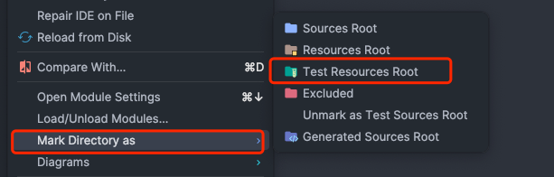
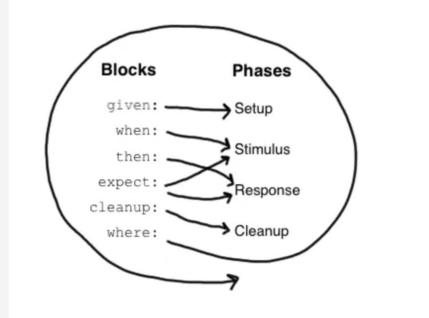

### Spock Mockito Integration

---

[](https://www.oracle.com/java/technologies/downloads/#java17)
[](https://docs.gradle.org/8.4/userguide/installation.html)
[](https://spockframework.org/spock/docs/2.3/index.html)
[]()


#### 引入依赖包
在项目的 `build.gradle` 文件中添加以下依赖：

```groovy
dependencies {
    testImplementation 'org.spockframework:spock-spring:2.4-M1-groovy-4.0'
}
```

#### 创建测试类

`spock` 使用 `groovy`编写

- 创建测试目录

`test`目录 --> 新增`groovy`目录 --> 右键【Mark Directory as Test Resources Root】


> 或者在 `build.gradle` 中添加以下配置：
```groovy
sourceSets {
    main {
        groovy {
            srcDirs = ['src/main/groovy']
        }
    }
    test {
        groovy {
            srcDirs = ['src/test/groovy']
        }
    }
}
```

- **新建 groovy class**

```groovy
import spock.lang.Specification

class SimpleSpec extends Specification {

    // 初始化
    def setupSpec() {
        println ">>>>> 初始化"
    }

    def setup() {
        println ">>>>> setup"
    }

    def cleanup() {
        println ">>>>> cleanup"
    }

    def cleanupSpec() {
        println ">>>>> cleanupSpec"
    }

    def "测试"() {

        given:
        def a = 1
        def b = 2

        expect:
        a > b

        println "a = $a, b = $b"
    }

}
```

- **执行顺序**

> `setupSpec()` ->  where[`setup()` -> `def` 自定义方法 ——> `cleanup()`] -> `cleanupSpec()`


#### `Spock`同`Junit`的类比

| `Spock`               | `Junit`                             |
|-----------------------|-------------------------------------|
| `Specification`       | `Test class`                        |
| `setupSpec()`         | `@BeforeClass`                      |
| `setup()`             | `@Before`                           |
| `cleanup()`           | `@After`                            |
| `cleanupSpec()`       | `@AfterClass`                       |
| `Feature`             | `Test`                              |
| `Feature method`      | `Test method`                       |
| `Data-driven feature` | `Theory`                            |
| `Condition`           | `Assertion`                         |
| `Exception condition` | `@Test(expected=...)`               |
| `Interaction`         | `Mock expectation(e.g. in Mockito)` |


- **Feature 方法**

feature的具体写法有很多的block组成，这些block对应的feature方法本身的四个阶段（setup, stimulus, reponse, cleanup) 。每个block对应阶段示意图




- **Extension**

```text
`spock`通过标注来扩充单元测试的功能
`@Timeout`指定一个测试方法，或一个设置方法最长可以执行的时间，用于对性能有要求的测试
`@Ignore`用于忽略当前的测试方法
`@IgnoreRest`忽略除当前方法外的所有方法，用于想快速的测一个方法
`@FailsWith` 跟`exception condition`类似
```
---

##### `Spock`引入了数据表的概念，将测试数据和代码分开

```groovy
class MathSpec extends Specification {
  def "maximum of two numbers"() {
    expect:
    Math.max(a, b) == c

    where:
    a | b || c
    1 | 3 || 3
    7 | 4 || 7
    0 | 0 || 0
  }
}
```

> 1. `where`语句中，定义数据表。第一行是表头，定义这一列所属的变量。  
> 2. 实际代码调用，只需要调用一次。代码中的变量跟数据表中的变量必须一一对应  
> 3. 看似一个方法，实际上执行时，`spock`会根据数据表中的行数，循环迭代执行代码。每一行都是独立于其余行执行，所以有`setup`和`cleanup`块，
对每一个行的都会重复执行一次  
> 4. 并且某一行的数据出错，并不影响其余行的执行  

  
  
- 另外的写法

```groovy
def "maximum of two numbers"(int a, int b ,int c) {
    expect:
    Math.max(a, b) == c

    where:
    a | b | c
    1 | 3 | 3
    7 | 4 | 4
    0 | 0 | 1
}
```

- 变量可以在方法参数中声明，但没必要
- 数据表可以全部用一个竖线来分割，但无法像两个竖线一样清晰的分割输入和输出

---

#### `@Mock`与`@Spy`
- 相同点
```text
对于未指定mock的方法，spy默认会调用真实的方法，有返回值的返回真实的返回值，而mock默认不执行，有返回值的，默认返回null
```
- 不同点
```text
1. Spy中用when...thenReturn私有方法总是被执行
2. Spy中用doReturn..when才会不执行真实的方法
3. mock中用 when...thenReturn 私有方法不会执行
```
- 代码统计覆盖率不同
```text
1. @spy使用的真实的对象实例，调用的都是真实的方法，所以通过这种方式进行测试，在进行sonar覆盖率统计时统计出来是有覆盖率；
2. @mock出来的对象可能已经发生了变化，调用的方法都不是真实的，在进行sonar覆盖率统计时统计出来的Calculator类覆盖率为0.00%
```

---

### Jacoco

#### 引入依赖包

```groovy
jacoco {
    toolVersion = "0.8.9"
}
```

#### 配置 jacocoTestReport 任务
```groovy

test {
    // report is always generated after tests run
    finalizedBy jacocoTestReport
}

def filter_groovy_file = "build/classes/groovy"

jacocoTestReport {
    // tests are required to run before generating the report
    dependsOn test

    // 添加需要统计的源代码
    sourceSets project(":server").sourceSets.main

    // 过滤目录
    afterEvaluate {
        classDirectories.setFrom(files(classDirectories.files.collect {
            if (!it.toString().contains(filter_groovy_file)) {
                return fileTree(dir: it, exclude: ['com/kon/App.*'])
            }
            return null
        }))
    }
}
```

#### 配置 jacoco 规则
```groovy

jacocoTestCoverageVerification {
    violationRules {
        // 全部规则
//        rule {
//            limit {
//                minimum = 0.9
//            }
//        }
        rule {
            enabled = true
            element = 'PACKAGE'
            includes = ['com.kon.api.controller',
                        'com.kon.service',
            ]

            limit {
                counter = 'BRANCH'
                minimum = 0.75
            }
            limit {
                counter = 'LINE'
                minimum = 0.75
            }
            limit {
                counter = 'METHOD'
                minimum = 0.75
            }
            limit {
                counter = 'CLASS'
                minimum = 0.100
            }
        }
    }
}
```

- `element` 指的是哪个元素，`PACKAGE`表示包，`CLASS`表示类，`METHOD`表示方法，`LINE`表示行，`BRANCH`表示分支
- `includes` 表示要包含的元素，可以是正则表达式
- `limit` 表示限制，`counter` 表示限制的类型，`minimum` 表示限制的最小值

---

```

### 参考

https://docs.gradle.org/8.4/userguide/jacoco_plugin.html
